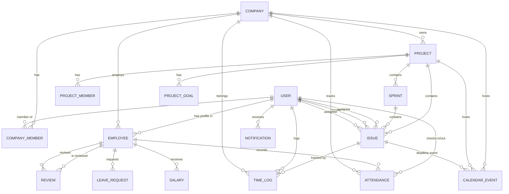
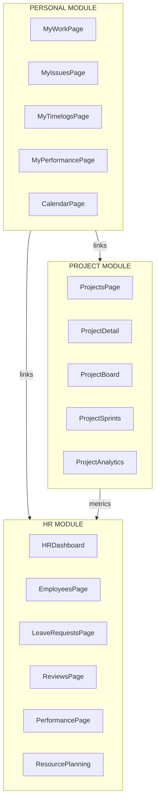
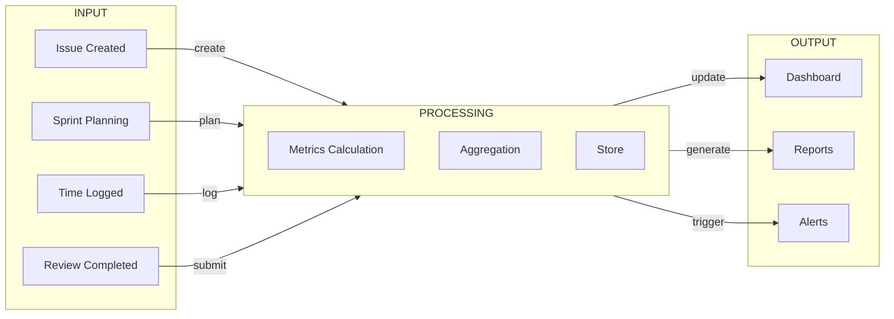

# System Architecture Document

**Version:** 1.0  
**Date:** May 11, 2026  
**Status:** Draft

---

## Table of Contents

1. [System Overview](#1-system-overview)
2. [Entity Relationship Diagram](#2-entity-relationship-diagram)
3. [Current State Analysis](#3-current-state-analysis)
4. [Module Architecture](#4-module-architecture)
5. [Data Flow Design](#5-data-flow-design)
6. [Page Specifications](#6-page-specifications)
7. [API Design](#7-api-design)
8. [Shared Components](#8-shared-components)
9. [Implementation Roadmap](#9-implementation-roadmap)

---

## 1. System Overview

This is a **multi-tenant Enterprise Management System** built with:
- **Backend:** Spring Boot (Java) - REST API
- **Frontend:** React + Vite + Tailwind CSS
- **Database:** Multi-tenant architecture with company-level isolation

### 1.1 Core Modules

| Module | Description |
|--------|-------------|
| **Authentication** | User login, registration, company selection, Google OAuth |
| **Company Management** | Company settings, members, invites, workspace join |
| **Project Management** | Projects, sprints, issues (Kanban), phases |
| **HR Management** | Employees, attendance, leave requests, reviews |
| **Time Tracking** | Timelogs per issue, timer, quick log |
| **Performance** | Individual & team performance metrics |
| **Calendar** | Events, meetings, deadlines |
| **Notifications** | Real-time notifications |
| **Reports** | Export to Excel, audit logs |

---

## 2. Entity Relationship Diagram



---

## 3. Current State Analysis

### 3.1 Current Pages

| Route | Page | Module | Status |
|-------|------|--------|--------|
| `/app/me/issues` | MyIssuesPage | Personal | Active |
| `/app/me/performance` | MyPerformancePage | Personal | Active |
| `/app/me/calendar` | CalendarPage | Personal | Active |
| `/app/me/profile` | ProfilePage | Personal | Active |
| `/app/hr/employees` | EmployeesPage | HR | Active |
| `/app/hr/leave-requests` | LeaveRequestsPage | HR | Active |
| `/app/hr/reviews` | ReviewsPage | HR | Active |
| `/app/hr/performance` | PerformanceOverviewPage | HR | Active |
| `/app/hr/resource-planning` | ResourcePlanningPage | HR | Active |
| `/app/projects` | ProjectsPage | Project | Active |
| `/app/projects/:id` | ProjectDetailPage | Project | Active |
| `/app/reports` | ReportsPage | Report | Active |
| `/app/company/settings` | CompanySettingsPage | Company | Active |
| `/app/company/activity` | ActivityLogPage | Company | Active |
| `/app/notifications` | NotificationsPage | Common | Active |

### 3.2 Project Detail Tabs

| Tab | Component | Purpose |
|-----|-----------|---------|
| Overview | OverviewTab | Project summary, activities, goals |
| Board | ProjectBoard | Kanban board |
| List | IssueListTab | Issue list view |
| Sprints | SprintTab | Sprint management |
| Goals | ProjectGoalTab | Project OKRs |
| Eisenhower | EisenhowerMatrixTab | Eisenhower matrix |
| Calendar | ProjectCalendarTab | Project calendar |
| Team | TeamTab | Team members |
| Performance | ProjectPerformanceTab | Project performance |
| Costs | ProjectCostTab | Project costs |
| Analytics | AnalyticsPage | Advanced analytics |
| Files | ProjectStorageTab | File storage |
| Settings | ProjectSettingsTab | Project settings |

### 3.3 Identified Problems

1. **Data Duplication:**
   - `MyPerformancePage` and `PerformanceOverviewPage` both fetch performance metrics
   - Dashboard data is fetched separately on each page
   - TimeLog data is fetched in multiple places

2. **Disconnected Pages:**
   - No clear navigation flow between related modules
   - User jumps between pages to see connected information
   - No unified dashboard per module

3. **Missing Integration:**
   - Issue completion does not auto-prompt for timelog
   - Leave approval does not update resource planning
   - Time logging does not auto-refresh performance metrics

4. **Redundant Data Fetching:**
   - Same API calls made on multiple pages
   - No shared state management for common data

---

## 4. Module Architecture

### 4.1 New Module Structure

```
frontend-web-v2/src/
├── pages/
│   ├── personal/                    # Personal Module
│   │   ├── MyWorkPage.jsx          # NEW: Personal dashboard
│   │   ├── MyIssuesPage.jsx        # Keep: Issue list
│   │   ├── MyTimelogsPage.jsx      # NEW: Dedicated timelog page
│   │   ├── MyPerformancePage.jsx  # REFACTOR: Performance only
│   │   └── ProfilePage.jsx         # Keep: Profile
│   │
│   ├── projects/                    # Project Module
│   │   ├── ProjectsPage.jsx         # Keep: Project list
│   │   ├── ProjectDetailPage.jsx    # REFACTOR: Container only
│   │   └── [tabs]/                  # Tab components
│   │       ├── ProjectDashboard.jsx  # NEW: Dashboard tab
│   │       ├── ProjectBoard.jsx     # ENHANCE: With metrics
│   │       └── ...
│   │
│   ├── hr/                         # HR Module
│   │   ├── HRDashboardPage.jsx     # NEW: HR dashboard
│   │   ├── EmployeesPage.jsx        # Keep
│   │   ├── LeaveRequestsPage.jsx    # Keep
│   │   ├── ReviewsPage.jsx          # Keep
│   │   ├── PerformancePage.jsx      # REFACTOR
│   │   └── ResourcePlanningPage.jsx  # Keep
│   │
│   └── reports/                    # Reports Module
│       └── ReportsPage.jsx
│
├── shared/
│   ├── hooks/                      # NEW: Shared hooks
│   │   ├── usePerformance.js
│   │   ├── useTimelogs.js
│   │   ├── useEmployee.js
│   │   └── useProject.js
│   │
│   ├── stores/                     # NEW: State management
│   │   ├── performanceStore.js
│   │   └── timelogStore.js
│   │
│   └── components/                 # NEW: Shared widgets
│       ├── PerformanceWidget.jsx
│       ├── TimelogWidget.jsx
│       ├── MetricCard.jsx
│       └── PerformanceTrend.jsx
```

### 4.2 Module Boundaries



---

## 5. Data Flow Design

### 5.1 Core Data Flow



### 5.2 Performance Data Flow

```
Issue Done
    │
    ▼
TimeLog Recorded
    │
    ▼
┌─────────────────────────┐
│  Metrics Calculator     │
│  ─────────────────────  │
│  Speed = DoneOnTime /   │
│        TotalAssigned    │
│                         │
│  Quality = 1 - Reworks  │
│           / Completed   │
│                         │
│  Volume = TotalDone /   │
│          AvgTeamDone    │
│                         │
│  Performance = Weighted │
│  Sum(Speed,Quality,    │
│      Volume)            │
└─────────────────────────┘
    │
    ▼
Performance Score Updated
    │
    ├──► MyPerformancePage
    ├──► PerformanceOverviewPage (HR)
    ├──► ProjectPerformanceTab
    └──► EmployeeCard (inline)
```

### 5.3 TimeLog Data Flow

```
Timer Start / Quick Log
    │
    ▼
┌─────────────────────────┐
│  TimeLog Created        │
│  ─────────────────────  │
│  - issue_id            │
│  - user_id             │
│  - logged_hours        │
│  - work_date           │
│  - description         │
└─────────────────────────┘
    │
    ├──► Issue.actual_hours += hours
    ├──► MyTimelogsPage
    ├──► MyPerformancePage
    └──► ProjectDashboard
```

---

## 6. Page Specifications

### 6.1 MyWorkPage - Personal Dashboard

**Route:** `/app/me` (redirects from `/app/me/issues`)

**Purpose:** Single entry point showing all personal data

**Layout:**
```
┌──────────────────────────────────────────────────────────────┐
│  CHÀO [Username] - [Date]                                    │
├──────────────────────────────────────────────────────────────┤
│  TODAY STATS    │ MY METRICS         │ QUICK ACTIONS        │
│  ─────────────  │ ────────────────   │ ──────────────────   │
│  Issues done: 3│ Performance: 8.5    │ [+ New Issue]        │
│  Hours: 6h     │ Speed: 8.0         │ [⏱ Log Time]        │
│  On Leave: No  │ Quality: 9.0       │ [📅 Calendar]       │
├──────────────────────────────────────────────────────────────┤
│  MY ISSUES TODAY                          [View All →]       │
│  ─────────────────────────────────────────────────────────   │
│  ☐ PROJ-123 | Task Title | 2h | 🔥 HIGH | Due: Today        │
│  ☐ PROJ-124 | Task Title | 4h | 🔥 MED  | Due: Tomorrow    │
├──────────────────────────────────────────────────────────────┤
│  MY TIMELOGS THIS WEEK                      [View All →]    │
│  ─────────────────────────────────────────────────────────   │
│  Mon: 8h (3 issues)  Tue: 6h (2 issues)  ...               │
│  Total this week: 34h / 40h (85%)                          │
├──────────────────────────────────────────────────────────────┤
│  MY PERFORMANCE                            [View All →]      │
│  ─────────────────────────────────────────────────────────   │
│  [Radar Chart]  This Week: 8.5  |  Trend: ↗ (+0.3)        │
└──────────────────────────────────────────────────────────────┘
```

**Data Sources:**
| API | Data |
|-----|------|
| `GET /api/issues/my-issues` | Assigned issues |
| `GET /api/timelogs/my?week=current` | Weekly timelogs |
| `GET /api/hr/performance/my-stats` | Personal metrics |
| `GET /api/leave-requests/team-calendar` | Leave status |

**Navigation Links:**
- "View All Issues" → `/app/me/issues`
- "View All Timelogs" → `/app/me/timelogs`
- "View All Performance" → `/app/me/performance`
- "Calendar" → `/app/me/calendar`

---

### 6.2 MyTimelogsPage - Dedicated Timelog Page

**Route:** `/app/me/timelogs`

**Purpose:** Detailed view and management of personal timelogs

**Layout:**
```
┌──────────────────────────────────────────────────────────────┐
│  MY TIMELOGS                              [+ Log Time] [⏱]  │
├──────────────────────────────────────────────────────────────┤
│  Filter: [Project ▼] [Date Range ▼] [Issue ▼]               │
├──────────────────────────────────────────────────────────────┤
│  TODAY - May 11, 2026                    Total: 4h          │
│  ─────────────────────────────────────────────────────────   │
│  PROJ-123 | Fix login bug      | 2h | ✓ Done               │
│  PROJ-456 | Update UI          | 2h | In Progress         │
├──────────────────────────────────────────────────────────────┤
│  YESTERDAY - May 10, 2026                  Total: 6h        │
│  ─────────────────────────────────────────────────────────   │
│  PROJ-123 | Code review       | 1h | ✓ Done                │
│  PROJ-123 | Unit test         | 5h | ✓ Done                │
├──────────────────────────────────────────────────────────────┤
│  SUMMARY BY PROJECT                                          │
│  ─────────────────────────────────────────────────────────   │
│  PROJ-123: 15h (5 issues)  ████████████░░░░  75%          │
│  PROJ-456: 5h  (2 issues)  ███░░░░░░░░░░░░  25%          │
└──────────────────────────────────────────────────────────────┘
```

**Data Sources:**
| API | Data |
|-----|------|
| `GET /api/timelogs/my` | All personal timelogs |
| `GET /api/projects/my-projects` | Projects for filter |
| `GET /api/issues/my-issues` | Issues for filter |

---

### 6.3 ProjectDashboard - Project Overview Tab

**Route:** `/app/projects/:id` (tab: dashboard)

**Purpose:** Project summary with team performance

**Layout:**
```
┌──────────────────────────────────────────────────────────────┐
│  [Project Name]                    [Status] [Team] [Edit]   │
├──────────────────────────────────────────────────────────────┤
│  ISSUES: 50 │ DONE: 30 │ IN PROG: 15 │ SPRINT: Sprint 5    │
│  Velocity: 20 pts │ Completed: 15 │ Remaining: 5 days      │
├──────────────────────────────────────────────────────────────┤
│  ┌─────────────────────────┐ ┌───────────────────────────┐  │
│  │   SPRINT BURNDOWN       │ │   TEAM CAPACITY           │  │
│  │   📉 Ideal vs Actual   │ │   Online: 5/10            │  │
│  │                        │ │   On Leave: 1             │  │
│  │                        │ │   Avg Load: 80%           │  │
│  └─────────────────────────┘ └───────────────────────────┘  │
├──────────────────────────────────────────────────────────────┤
│  TOP PERFORMERS THIS SPRINT                                  │
│  ─────────────────────────────────────────────────────────   │
│  1. [👤] John Doe - 9.2 perf - 15 issues completed        │
│  2. [👤] Mary Smith - 8.8 perf - 12 issues completed      │
├──────────────────────────────────────────────────────────────┤
│  PROJECT GOALS                            [+ Add Goal]     │
│  ─────────────────────────────────────────────────────────   │
│  ☐ Goal 1: Deliver feature X      0/5 issues               │
│  ☑ Goal 2: Improve performance    3/3 issues ✓             │
├──────────────────────────────────────────────────────────────┤
│  RECENT ACTIVITY                                            │
│  ─────────────────────────────────────────────────────────   │
│  • John moved PROJ-123 to Done          2 min ago           │
│  • Mary commented on PROJ-124            15 min ago         │
└──────────────────────────────────────────────────────────────┘
```

**Data Sources:**
| API | Data |
|-----|------|
| `GET /api/projects/:id` | Project info |
| `GET /api/project-dashboard/project/:id/stats` | Dashboard stats |
| `GET /api/projects/:id/members` | Team members |
| `GET /api/projects/:id/goals` | Project goals |
| `GET /api/sprints/project/:id` | Sprint list |
| `GET /api/project-dashboard/sprint/:id/burndown` | Burndown data |
| `GET /api/hr/performance-comparison/projects/:id` | Team performance |

---

### 6.4 HRDashboard - HR Overview Page

**Route:** `/app/hr` (dashboard)

**Purpose:** HR department overview with key metrics

**Layout:**
```
┌──────────────────────────────────────────────────────────────┐
│  HR DASHBOARD                           [Period: This Month ▼]│
├──────────────────────────────────────────────────────────────┤
│  HEADCOUNT │ ON LEAVE  │ ATTENDANCE │ PENDING REVIEWS       │
│     45     │    3      │    92%     │        5              │
│  +2 this m │  Today    │   Today    │ Leave: 2              │
├──────────────────────────────────────────────────────────────┤
│  ┌─────────────────────────┐ ┌───────────────────────────┐  │
│  │ TOP PERFORMERS           │ │ AT RISK EMPLOYEES         │  │
│  │ 1. John Doe - 9.2 perf  │ │ 1. Jane - 3 overdue      │  │
│  │ 2. Mary Smith - 8.8 perf│ │ 2. Bob - 5 reworks       │  │
│  │ 3. David Lee - 8.5 perf │ │                           │  │
│  └─────────────────────────┘ └───────────────────────────┘  │
├──────────────────────────────────────────────────────────────┤
│  UPCOMING LEAVES                                            │
│  ─────────────────────────────────────────────────────────   │
│  📅 May 15-17: John - Annual Leave                         │
│  📅 May 20-22: Mary - Sick Leave                           │
├──────────────────────────────────────────────────────────────┤
│  PROJECT RESOURCE UTILIZATION                                │
│  ─────────────────────────────────────────────────────────   │
│  Project Alpha: 90% (slightly overloaded)                   │
│  Project Beta: 75% (good balance)                          │
│  Project Gamma: 50% (low utilization)                       │
└──────────────────────────────────────────────────────────────┘
```

**Data Sources:**
| API | Data |
|-----|------|
| `GET /api/employees` | Employee count |
| `GET /api/leave-requests/team-calendar` | Leave calendar |
| `GET /api/attendance/report` | Attendance stats |
| `GET /api/reviews/pending` | Pending reviews |
| `GET /api/hr/performance-overview` | All performance |
| `GET /api/resources/allocations` | Resource planning |

---

## 7. API Design

### 7.1 Performance APIs

#### GET /api/hr/performance/dashboard
**Purpose:** Aggregated metrics for HR dashboard

**Response:**
```json
{
  "totalEmployees": 45,
  "averagePerformance": 7.8,
  "averageSpeed": 7.5,
  "averageQuality": 8.0,
  "averageVolume": 7.2,
  "totalCompletedTasks": 1234,
  "totalOverdueTasks": 45,
  "totalReworks": 89,
  "topPerformers": [
    {
      "employeeId": 1,
      "employeeName": "John Doe",
      "overallScore": 9.2,
      "completedTasks": 45
    }
  ],
  "atRiskEmployees": [
    {
      "employeeId": 2,
      "employeeName": "Jane",
      "overdueTasks": 3,
      "reworks": 5
    }
  ],
  "performanceByProject": [
    {
      "projectId": 1,
      "projectName": "Alpha",
      "averagePerformance": 8.5
    }
  ],
  "performanceTrend": [
    { "week": "2026-W18", "avgPerformance": 7.6 },
    { "week": "2026-W19", "avgPerformance": 7.8 }
  ]
}
```

#### GET /api/hr/performance/employees/:id/summary
**Purpose:** Individual employee performance summary

**Response:**
```json
{
  "employeeId": 123,
  "employeeName": "John Doe",
  "department": "Engineering",
  "overallScore": 8.5,
  "scores": {
    "performance": 8.5,
    "speed": 8.0,
    "quality": 9.0,
    "volume": 8.5
  },
  "metrics": {
    "completedTasks": 45,
    "overdueTasks": 2,
    "reworks": 3,
    "totalHoursLogged": 320,
    "storyPointsCompleted": 120
  },
  "projects": [
    {
      "projectId": 1,
      "projectName": "Alpha",
      "performanceScore": 8.5,
      "completedTasks": 25
    }
  ],
  "recentReviews": [
    {
      "reviewId": 1,
      "period": "Q1-2026",
      "totalScore": 8.5,
      "status": "APPROVED"
    }
  ],
  "trend": [
    { "week": "2026-W18", "performance": 8.2 },
    { "week": "2026-W19", "performance": 8.5 }
  ]
}
```

### 7.2 Timelog Aggregation APIs

#### GET /api/timelogs/summary/my
**Purpose:** User's timelog summary

**Response:**
```json
{
  "totalHoursThisWeek": 40,
  "totalHoursThisMonth": 160,
  "totalHoursAllTime": 2400,
  "hoursByProject": [
    {
      "projectId": 1,
      "projectName": "Alpha",
      "totalHours": 100,
      "issueCount": 15
    }
  ],
  "hoursByDay": [
    { "date": "2026-05-11", "hours": 8 },
    { "date": "2026-05-10", "hours": 6 }
  ],
  "hoursByIssue": [
    {
      "issueId": 123,
      "issueKey": "PROJ-123",
      "title": "Fix bug",
      "totalHours": 4
    }
  ]
}
```

#### GET /api/timelogs/project/:id/summary
**Purpose:** Project timelog aggregation

**Response:**
```json
{
  "projectId": 1,
  "projectName": "Alpha",
  "totalHours": 1200,
  "hoursByMember": [
    {
      "userId": 1,
      "userName": "John Doe",
      "totalHours": 320,
      "issueCount": 25
    }
  ],
  "hoursBySprint": [
    {
      "sprintId": 5,
      "sprintName": "Sprint 5",
      "totalHours": 400
    }
  ],
  "averagePerIssue": 4.5,
  "totalIssues": 267
}
```

---

## 8. Shared Components

### 8.1 PerformanceWidget

**Usage:** Shows individual performance scores

**Props:**
| Prop | Type | Default | Description |
|------|------|---------|-------------|
| `employeeId` | number | required | Employee ID to fetch |
| `compact` | boolean | false | Show only overall score |
| `showTrend` | boolean | true | Show trend indicator |
| `size` | 'sm' \| 'md' \| 'lg' | 'md' | Widget size |

**Variants:**
1. **Inline:** Used in employee cards, issue cards
2. **Compact:** Used in lists, dropdowns
3. **Full:** Used in detail pages

### 8.2 TimelogWidget

**Usage:** Shows timelog summary

**Props:**
| Prop | Type | Default | Description |
|------|------|---------|-------------|
| `userId` | number | current user | User ID |
| `period` | 'day' \| 'week' \| 'month' | 'week' | Time period |
| `showChart` | boolean | false | Show mini chart |
| `compact` | boolean | false | Compact view |

### 8.3 MetricCard

**Usage:** Generic metric display card

**Props:**
| Prop | Type | Default | Description |
|------|------|---------|-------------|
| `title` | string | required | Card title |
| `value` | number \| string | required | Metric value |
| `subtitle` | string | - | Secondary info |
| `icon` | string | - | FontAwesome icon |
| `color` | string | 'indigo' | Color theme |
| `trend` | number | - | Trend percentage |
| `trendDirection` | 'up' \| 'down' \| 'neutral' | - | Trend direction |

---

## 9. Implementation Roadmap

### Phase 1: Core Infrastructure (Week 1-2)

**Tasks:**
1. Create shared hooks: `usePerformance`, `useTimelogs`, `useEmployee`
2. Create shared stores: `performanceStore`, `timelogStore`
3. Create reusable widgets: `PerformanceWidget`, `TimelogWidget`, `MetricCard`
4. Add backend aggregation APIs

**Deliverables:**
- `/shared/hooks/usePerformance.js`
- `/shared/hooks/useTimelogs.js`
- `/shared/hooks/useEmployee.js`
- `/shared/stores/performanceStore.js`
- `/shared/stores/timelogStore.js`
- `/shared/components/PerformanceWidget.jsx`
- `/shared/components/TimelogWidget.jsx`
- `/shared/components/MetricCard.jsx`

### Phase 2: Personal Module (Week 3)

**Tasks:**
1. Create `MyWorkPage.jsx` - Personal dashboard
2. Create `MyTimelogsPage.jsx` - Dedicated timelog page
3. Refactor `MyPerformancePage.jsx` - Performance only
4. Add navigation links

**Deliverables:**
- `/pages/personal/MyWorkPage.jsx`
- `/pages/personal/MyTimelogsPage.jsx`
- Updated routing

### Phase 3: Project Module (Week 4-5)

**Tasks:**
1. Create `ProjectDashboard.jsx` - Dashboard tab
2. Enhance `ProjectBoard.jsx` with inline metrics
3. Add team performance section
4. Integrate with shared widgets

**Deliverables:**
- `/pages/projects/tabs/ProjectDashboard.jsx`
- Enhanced `/pages/projects/components/ProjectBoard.jsx`

### Phase 4: HR Module (Week 6-7)

**Tasks:**
1. Create `HRDashboardPage.jsx` - HR overview
2. Refactor `PerformanceOverviewPage.jsx` using shared widgets
3. Enhance `EmployeesPage` with inline performance
4. Add resource utilization visualization

**Deliverables:**
- `/pages/hr/HRDashboardPage.jsx`
- Refactored `/pages/hr/PerformanceOverviewPage.jsx`
- Enhanced `/pages/hr/EmployeesPage.jsx`

### Phase 5: Integration & Polish (Week 8)

**Tasks:**
1. Integrate timer bar with performance auto-refresh
2. Add issue completion → timelog prompt
3. Add leave approval → resource update
4. Performance calculation background job optimization
5. Documentation

**Deliverables:**
- Enhanced `/shared/components/GlobalTimerBar.jsx`
- Updated issue flow UX
- Final documentation

---

## Appendix A: Route Map

```mermaid
flowchart TB
    APP[/app]
    ME[/app/me]
    HR[/app/hr]
    PROJ[/app/projects]

    APP --> ME
    APP --> HR
    APP --> PROJ

    ME --> ME_ISSUES[/app/me/issues]
    ME --> ME_TIMELOGS[/app/me/timelogs]
    ME --> ME_PERF[/app/me/performance]
    ME --> ME_CAL[/app/me/calendar]
    ME --> ME_PROFILE[/app/me/profile]

    HR --> HR_DASH[/app/hr]
    HR --> HR_EMP[/app/hr/employees]
    HR --> HR_LEAVE[/app/hr/leave-requests]
    HR --> HR_REV[/app/hr/reviews]
    HR --> HR_PERF[/app/hr/performance]
    HR --> HR_RP[/app/hr/resource-planning]

    PROJ --> PROJ_LIST[/app/projects]
    PROJ --> PROJ_DETAIL[/app/projects/:id]
    PROJ_DETAIL --> PROJ_DASH[Dashboard]
    PROJ_DETAIL --> PROJ_BOARD[Board]
    PROJ_DETAIL --> PROJ_SPRINT[Sprints]
    PROJ_DETAIL --> PROJ_GOALS[Goals]
    PROJ_DETAIL --> PROJ_TEAM[Team]
    PROJ_DETAIL --> PROJ_PERF[Performance]
    PROJ_DETAIL --> PROJ_ANALYTICS[Analytics]
```

---

## Appendix B: Color System

| Metric | Color | Hex |
|--------|-------|-----|
| Performance | Indigo | #6366f1 |
| Speed | Teal | #14b8a6 |
| Quality | Amber | #f59e0b |
| Volume | Purple | #8b5cf6 |
| Success | Green | #22c55e |
| Danger | Red | #ef4444 |
| Warning | Orange | #f97316 |
| Info | Blue | #3b82f6 |

---

## Appendix C: Score Thresholds

| Rating | Score Range | Color |
|--------|-------------|-------|
| Excellent | 9.0 - 10.0 | Green |
| Good | 8.0 - 8.9 | Indigo |
| Satisfactory | 6.5 - 7.9 | Amber |
| Average | 5.0 - 6.4 | Orange |
| Poor | < 5.0 | Red |
